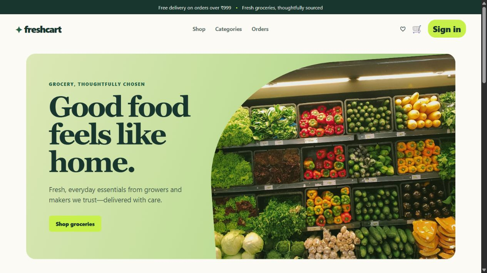
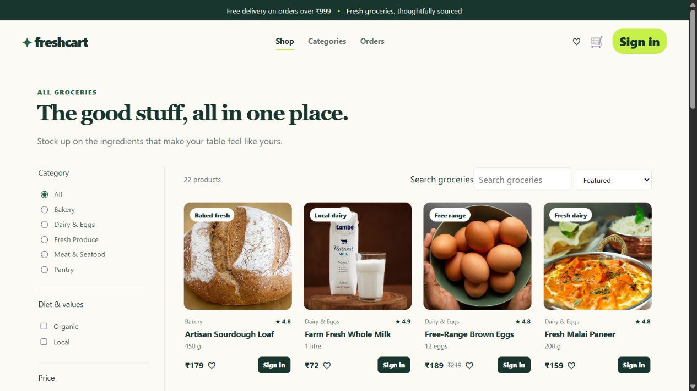
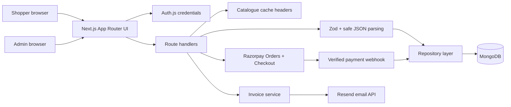

# FreshCart

> A full-stack grocery storefront built to demonstrate product thinking, secure application boundaries, and a complete customer-to-operations workflow.

[](https://nextjs.org/)
[](https://www.typescriptlang.org/)
[](https://www.mongodb.com/)

**Live demo:** [freshcart-grocery-mu.vercel.app](https://freshcart-grocery-mu.vercel.app)

> The demo is deployed on Vercel. Its database-backed routes require the MongoDB Atlas production connection and network access to be configured.

FreshCart lets shoppers browse groceries, save favourites, manage a cart, complete checkout, and review past orders. It also includes a protected admin area for managing the catalogue, stock, discounts, fulfilment, and user roles.

## Product tour





The screenshots are committed so GitHub renders them directly. A short checkout GIF can be added here later without changing the README structure.

## Highlights

- End-to-end shopper flow: registration, sign-in, catalogue browsing, wishlist, cart, delivery-slot checkout, payment confirmation, invoices, and order history.
- MongoDB-backed product catalogue and user state; the JSON catalogue is seed data only, not the runtime data store.
- Admin dashboard for products, stock, categories, discounts, order status, and customer/admin roles.
- Responsive catalogue filters with shareable URL state (`category`, search, values, price, and sort) and cached catalogue responses.
- Accessible interaction design: semantic landmarks, skip link, visible keyboard focus, descriptive icon controls, and modal focus trapping/restoration.
- Razorpay Checkout integration: server-calculated INR totals, server-side payment-signature verification, webhook validation, and a development-only dummy-payment path.
- Invoice emails through Resend, with escaped dynamic HTML and a generated PDF receipt attachment.
- Defensive API layer: strict Zod validation, malformed JSON handling, distributed Upstash rate limits when configured, and structured PII-safe error logging.
- Automated tests for order rules, API routes, accessibility, keyboard behaviour, and the sign-up → cart → checkout journey.

## Architecture



### Data model

MongoDB stores these indexed collections:

- `users` — identity, password hash, and role.
- `products` and `categories` — customer-facing catalogue plus stock and availability.
- `carts` and `wishlists` — account-scoped shopper state.
- `discounts` — active fixed or percentage promotions.
- `orders` — immutable order lines, delivery slot/instructions, payment state, reservations, and fulfilment history.
- `delivery_slots` — capacity-managed delivery windows reserved alongside inventory.
- `processed_webhooks` — provider-event deduplication for idempotent payment processing.

## Stack

| Area           | Technology                                                                  |
| -------------- | --------------------------------------------------------------------------- |
| UI             | Next.js 14 App Router, React 18, TypeScript, CSS                            |
| Images         | `next/image` with responsive Unsplash assets                                |
| Authentication | Auth.js credentials provider and bcrypt password hashes                     |
| Database       | MongoDB Node.js driver with collection indexes                              |
| Validation     | Zod and a defensive JSON parsing helper                                     |
| Email          | Resend and a small PDF invoice generator                                    |
| Payments       | Razorpay Orders, Checkout, signature verification, webhooks                 |
| Rate limiting  | Upstash Redis in production; deterministic in-memory adapter for local/test |
| Testing        | Vitest, Playwright, and axe-core                                            |

## Run locally

### Prerequisites

- Node.js 20 or later
- A MongoDB Atlas or local MongoDB connection string
- A Resend API key only if you want to send real invoices
- Razorpay test keys only if you want to exercise real hosted checkout

### Setup

1. Install dependencies.

   ```bash
   npm install
   ```

2. Copy the environment template and fill in the required values.

   ```bash
   Copy-Item .env.example .env.local
   ```

3. At minimum, set `AUTH_SECRET`, `MONGODB_URI`, and `MONGODB_DB` in `.env.local`.

   ```env
   AUTH_SECRET=use-a-long-random-secret
   MONGODB_URI=mongodb+srv://<user>:<password>@<cluster>/?retryWrites=true&w=majority
   MONGODB_DB=freshcart
   ADMIN_EMAIL=you@example.com
   ```

4. Start the app.

   ```bash
   npm run dev
   ```

5. Open [http://localhost:3000](http://localhost:3000). The first successful catalogue request creates the database indexes and seeds the sample products and categories.

### Invoice email configuration

Add these optional variables to enable delivery through Resend:

```env
RESEND_API_KEY=re_your_key
INVOICE_FROM="FreshCart <onboarding@resend.dev>"
# Before a sending domain is verified, Resend can only deliver to this account email.
INVOICE_TEST_RECIPIENT=you@example.com
```

For production, verify a sending domain in Resend and use it in `INVOICE_FROM`.

### Razorpay test checkout

For hosted test payments, add the following server-only variables. Test keys start with `rzp_test_`; do not commit the secret values.

```env
RAZORPAY_KEY_ID=rzp_test_your_key_id
RAZORPAY_KEY_SECRET=your_key_secret
RAZORPAY_WEBHOOK_SECRET=your_webhook_secret
APP_URL=http://localhost:3000
```

Without Razorpay keys, development uses the explicit dummy-payment path. Production does not enable dummy payments.

## Demo accounts

FreshCart deliberately has **no shared hard-coded account**. Create one through the sign-up screen:

| Role          | Email                          | Password                          | How it is assigned                                                  |
| ------------- | ------------------------------ | --------------------------------- | ------------------------------------------------------------------- |
| Shopper       | Any email you control          | Any password with 8+ characters   | Register at `/auth`                                                 |
| Administrator | The email set as `ADMIN_EMAIL` | Your chosen 8+ character password | Set `ADMIN_EMAIL`, then register that same email and visit `/admin` |

This keeps credentials out of source control and makes the setup safe to deploy.

## Demo script

1. Register a shopper account at `/auth`.
2. Browse `/products`, filter by category or values, and add products to the cart.
3. Choose a delivery slot and optional instructions at checkout.
4. Complete the Razorpay test checkout, or use the local dummy-payment path.
5. Open `/orders` to show payment, reservation, fulfilment, and delivery details.
6. Sign in with the `ADMIN_EMAIL` account and open `/admin` to manage stock, catalogue data, promotions, customers, and fulfilment transitions.

## Tests

```bash
npm run test:unit       # order maths, validation, safety helpers, rate limits
npm run test:api        # MongoDB-backed route integration tests
npm run test:e2e        # Playwright sign-up → cart → checkout flow
npm run test:coverage   # coverage report
npm run test:all        # every automated suite
```

The API and browser suites require a separate test database whose name ends in `_test` or `_e2e`; the reset script refuses to touch any other database. See [TEST.md](TEST.md) for the full test setup and scope.

## CI/CD and deployment

The [GitHub Actions workflow](.github/workflows/ci.yml) provides a release gate on every pull request and push to `main`:

1. Type-checks the application.
2. Runs unit tests, MongoDB-backed API tests, and Playwright checkout tests.
3. Builds the Next.js application.
4. After a successful push to `main`, pulls the Vercel production environment, builds a prebuilt artifact, and deploys it to production.

### One-time GitHub setup

Add these repository secrets in **Settings → Secrets and variables → Actions**:

| Secret              | Purpose                                                        |
| ------------------- | -------------------------------------------------------------- |
| `VERCEL_TOKEN`      | Vercel personal or team token used only by the deployment job. |
| `VERCEL_ORG_ID`     | Vercel organisation ID from `.vercel/project.json`.            |
| `VERCEL_PROJECT_ID` | Vercel project ID from `.vercel/project.json`.                 |

Then add the repository variable `VERCEL_DEPLOY_ENABLED` with value `true` in **Settings → Secrets and variables → Actions → Variables**. This keeps CI green until deployment credentials are intentionally configured.

### One-time Vercel setup

1. Import the GitHub repository into Vercel as a Next.js project, or run `npx vercel@latest link` locally after logging in. CI starts its own disposable MongoDB container, so it never needs production database credentials.
2. In Vercel project settings, add the variables from `.env.example` to **Production** and **Preview**. Keep `MONGODB_URI`, `AUTH_SECRET`, and `RESEND_API_KEY` server-only.
3. Copy the generated organisation and project IDs from `.vercel/project.json` into the GitHub secrets above. The `.vercel` directory is ignored and must never be committed.
4. Push to `main`. GitHub Actions runs the quality gate first, then deploys the validated Vercel artifact.

## Project structure

```text
src/
├── app/                 # Pages and API route handlers
├── components/          # Reusable UI, checkout, and dialog components
├── context/             # Client store and catalogue request cache
├── data/                # Seed-only product data
├── lib/                 # Auth, MongoDB, repository, validation, invoices
└── types/               # Shared TypeScript definitions
tests/
├── unit/                # Fast business-rule and utility tests
├── api/                 # Route tests using an isolated MongoDB database
└── e2e/                 # Playwright shopper, accessibility, and keyboard tests
```

## Security and reliability decisions

- Passwords are bcrypt-hashed; raw passwords, credentials, and request bodies are not logged.
- Registration and login are rate-limited per forwarded client IP.
- Mutation routes safely reject malformed JSON (`400`) and invalid schema input (`422`).
- Admin routes require a server-checked `admin` role from MongoDB.
- Catalogue responses are cacheable for 60 seconds and permit five minutes of stale-while-revalidate; the client also shares a catalogue request across remounts.
- Invoice fields are HTML-escaped before entering the email template.
- Pending checkout orders reserve inventory and delivery-slot capacity; paid orders consume the reservation once.

## Trade-offs and next steps

- **Razorpay is test-mode first.** The implementation supports hosted checkout and verified callbacks, but the production account, webhook endpoint, settlement configuration, and refund operations still need operational verification before a real launch.
- **Rate-limit fallback is local only.** Upstash Redis is used when configured; the in-memory adapter is intentionally retained for development and tests.
- **Catalogue filtering is client-side but URL-persisted.** This keeps the current small catalogue responsive and shareable. Move filtering and pagination into `/api/catalog` as the catalogue grows.
- **Image hosting uses Unsplash.** Product images should move to owned, optimized media storage before launch.
- **Resend sandbox limits apply.** Without a verified domain, invoices can only reach the Resend account email configured as `INVOICE_TEST_RECIPIENT`.
- **A custom domain is not configured yet.** The Vercel URL is suitable for the portfolio; add a custom domain before a public launch.

## Resume-ready talking points

FreshCart is a focused example of owning a web product beyond its UI: modelling operational data, securing mutations, handling edge cases, integrating a payment provider, building test coverage, and documenting realistic production trade-offs.
